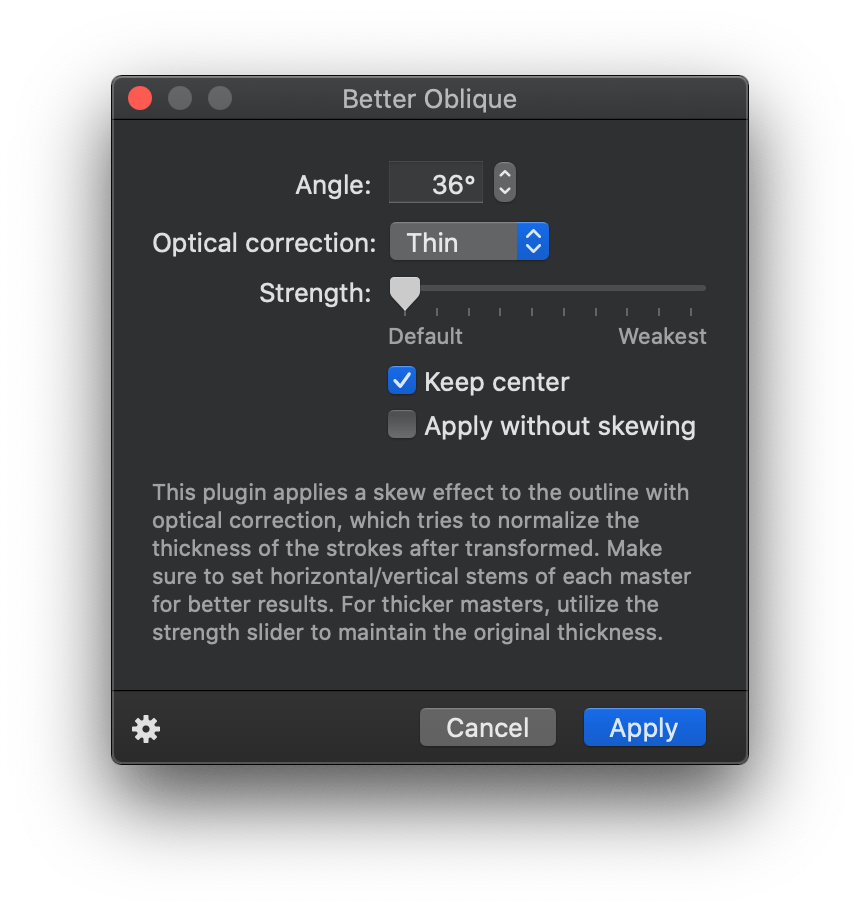
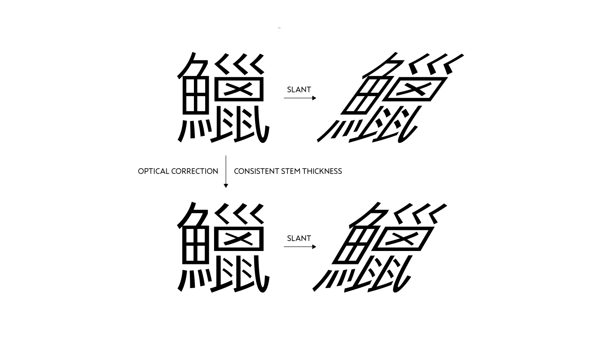

# BetterOblique.glyphsFilter

An experimental Glyphs filter plugin to skew outlines with optical correction so that the stem thickness gets consistent after transformation.

## Installation

1. Download the ZIP archive and unpack it, or clone the repository.
2. Double-click the `.glyphsFilter` in the Finder. Confirm the dialog that appears in Glyphs.
3. Restart Glyphs.

## Usage

1. Measure and set horizontal/vertical stem values in the Font Info dialog.
2. Choose Filter > Better Oblique on the menu.
3. Enter the oblique angle you want to apply.
4. Tweak the result with the Optical correction and the Strength options.
5. Press OK to apply the filter.

## Background

Some of the CJK radicals have diagonal strokes, and they will get inconsistent stem thickness when skewed. This plugin tries to compensate the thickness by gradually offsetting the path according to the angle of each segment, while the Cursify feature in Glyphs is implemented with more focus on maintaining the contrast. Although developed with CJK fonts in mind, you might find it useful for other scripts as well.

## Known Issues

- Might generate distorted outlines when offsetting serifs.

## Requirements

Tested with Glyphs 2.6.5 on OS X 10.11 and Glyphs 3.2 on macOS 10.15.7.

## License

Apache License 2.0

## Acknowledgements

The copies of the dependencies [simoncozens/beziers.py](https://github.com/simoncozens/beziers.py) and [fonttools/pyclipper](https://github.com/fonttools/pyclipper) are included in the plugin so that it should work standalone.
